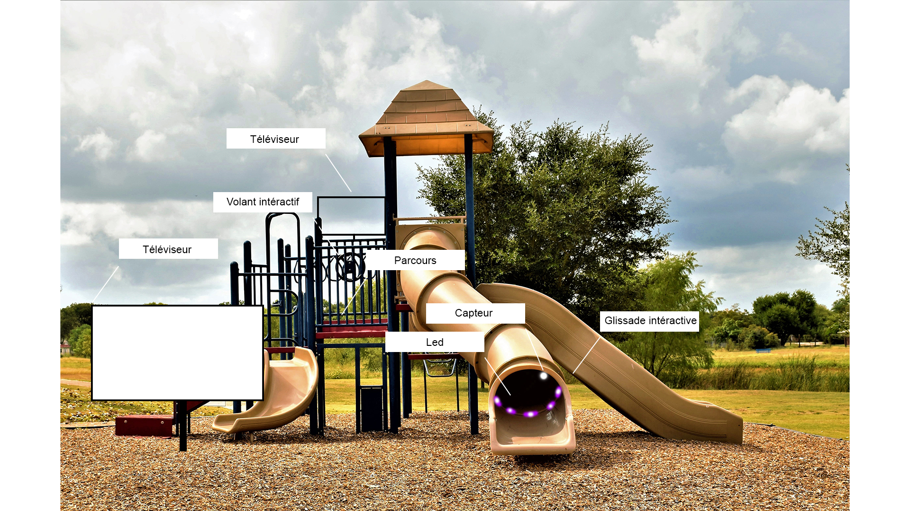

# Présentation d'une idée pouyr le projet final

Lors de notre troisième année, nous avons la tâche de créer une installation intéractive. Pour ceci, je vais vous présenter une idée de projet final que nous pourrons, moi et mon équipe, discuter et élaborer.

## Plan de présentation 

# Explication des intéractions

## Première intéraction
À l'aide d'une simple vidéo, l'intélligence artificielle, développé par Wonder Studio, va détecter la présence humaine, transformer celle-ci en un personnage 3D et intégrer des lumières adéquates. Selon Wonder Studio, l'IA va automatiser 80% à 90% du travail manuel de VFX tout en réduisant les coût de matériels de motion capture. 

## Deuxième intéraction
La plateforme 

# Troisième intéraction

## L'avancée de la VFX grâce à Wonder Studio

## Compagnies qui utilisent Wonder Studio

# Exemple du fonctionnement

## Exemple d'intégration dans une scène 3D

## Rendu de la scène

# Documentation

Wonder Studio / Documentation / « [WonderDynamicsDocumentation](https://help.wonderdynamics.com/intro-to-wonder-studio/introduction) »
Wonder Studio / Page d'accueil /« [WonderDynamicsAccueil](https://wonderdynamics.com/) »
Cgchannel / 11 juin 2023 / Jim Thacker / Wonder Studio is available / « [Wonder Studio is available](https://www.cgchannel.com/2023/07/wonder-studio-is-now-available/) »
