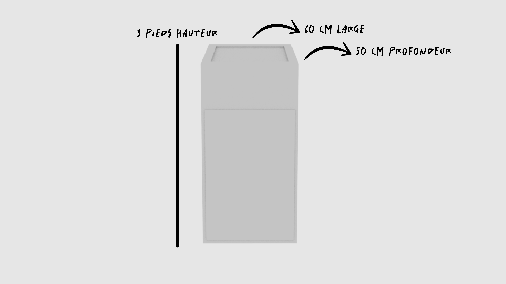
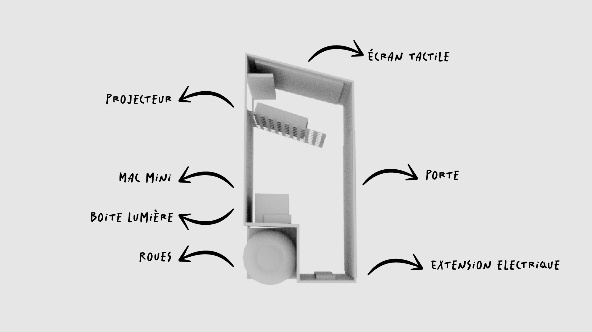
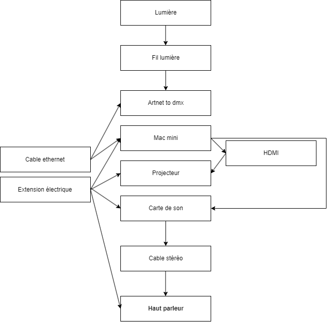

# Canevas intéractif

## Borne

## Matériels
- Projecteur
- Mac mini
- Boite Arnet to dmx
- Panneau perforé en métal
- Vinyl
- Panneau mdf
- Charnière
- Vis
- Haut parleur
- Tube de lumière
- Led
- Cable Ethernet
- Hdmi
- Cable stéréo
- Cable de lumière
- Extension électrique
  
## Achats
- [Vinyl](https://www.imprimerieengros.com/autocollant-vinyle-perfore/)
- Charnière
- Panneau mdf
- Vis
- Panneau perforé en métal
- Mac mini

## Problématiques probables de la borne
- Coût des matériaux ( bois,vinyl )
- Mauvaise sonorité des hauts parleurs
- Surchauffe du projecteur

## Design

