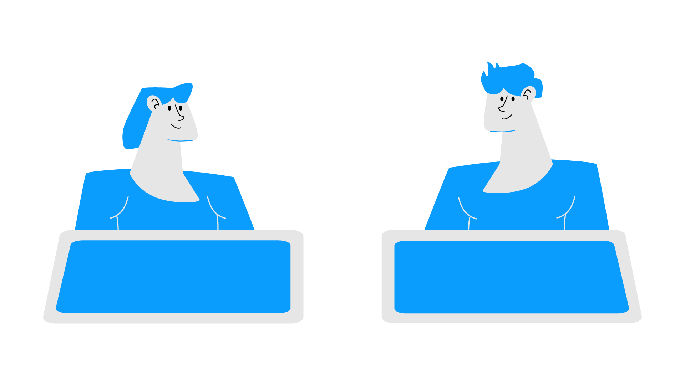
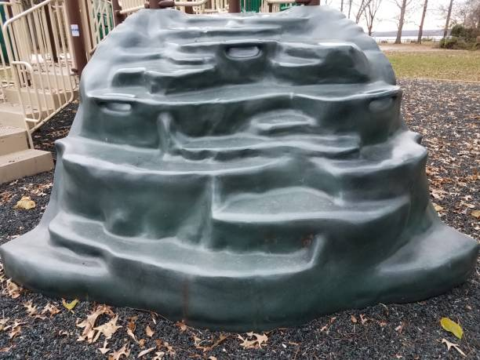

# Présentation d'une idée pour le projet final

Lors de notre troisième année, nous avons la tâche de créer une installation intéractive. Pour ceci, je vais vous présenter une idée de projet final que nous pourrons, moi et mon équipe, discuter et élaborer. L'idée serait de créer, à l'aide d'une module pour enfant, une structure intéractive qui démontre l'évolution du divertissement des enfants.

# Plan de présentation 

# Explication des intéractions
La structure intéractive va intégrer principalement quatre intégrations en deux catégories, la première catégorie va être la catégorie enfant et la seconde va être celle pour les adultes. Pour la catégorie destinée aux enfants, il va y avoir une glissade intéractive, un jeu intéractif, un passage intéractif et une grotte intéractive pour la catégorie destinée aux adultes, il va y avoir une pancarte intéractive.

## Première intéraction
Premièrement, il va y avoir un parcours de lumières et de sons. Cela va être possible à l'aide de mini capteur, de lumière et d'hauts parleurs qui vont être placés tout au long du module. Le capteur va détecter l'intéracteur et ensuite activé un scène. La scène va actionner les lumières et les hauts parleurs. 

## Deuxième intéraction
Deuxièmement, il va y avoir un jeu intéractif sur une table. Le jeu serait une peu ressemblant à une bataille navale mais intéractif avec des animations. Le jeu aura deux écran et deux modules intéractifs qui serviront à placer leurs petits bateaux. Nous allons trouver une façon de garder le concept tout en ne pas copier le jeux.  

## Troisième intéraction
Troisièment, il va avoir une glissade intéractive, la glissade serait illuminé grâce à des bandes de lumières LED qui seront programmées pour intéragir avec la présence humaine grâce à des capteurs de présences.

## Quatrième intéraction
Quatrièmement, il va y avoir une grotte avec une projection. À l'aide d'un projecteur et de MadMapper, nous allons reproduire une petite histoire en s'inspirant des dessins que les hommes de caverne sculptaient dans les roches.

## Cinquième intéraction
Finalement, il va y avoir une pancarte déroulante décrivant l'oeuvre, mais certains éléments seront seulement visible par des enfants. En effet à l'aide de la technolgie "Lenticular printing", l'utilisateur pourra voir un texte afficher et celui va différencer par rapport avec sa grandeur.

## Présentation de MadMapper
Pour créer certaine des intéractions, nous aurons besoins d'utiliser MadMapper. MadMapper est un logiciel que nous allons voir cette année dans l'un de nos cours, mais laisser moi vous l'expliquez un peu. MadMapper est un logiciel utilisé pour le mapping vidéo donc pour projeter des vidéos ou des images sur des surfaces ondulés. Ce logiciel nous sera très utile lorsque nous allons projeter une vidéo sur la grotte. Comme la grotte n'est pas une surface plane, nous aurons besoins de MadMapper pour que la projection s'adapte à la surface.

## Technique de MadMapper
Pour utiliser MadMapper, nous avons besoins de créer une carte , ou en anglais « mapping » , entre les points de notre médias ceux de la surface à projecter. Cela permet de déformer l'image pour qu'elle corresponde parfaitement à la forme de la surface.

## Oeuvres avec MadMapper
[Oeuvre](https://madmapper.com/gallery/)
### Documentation

MadMapper / Gallerie / « [MadMapper](https://madmapper.com/gallery/) »

