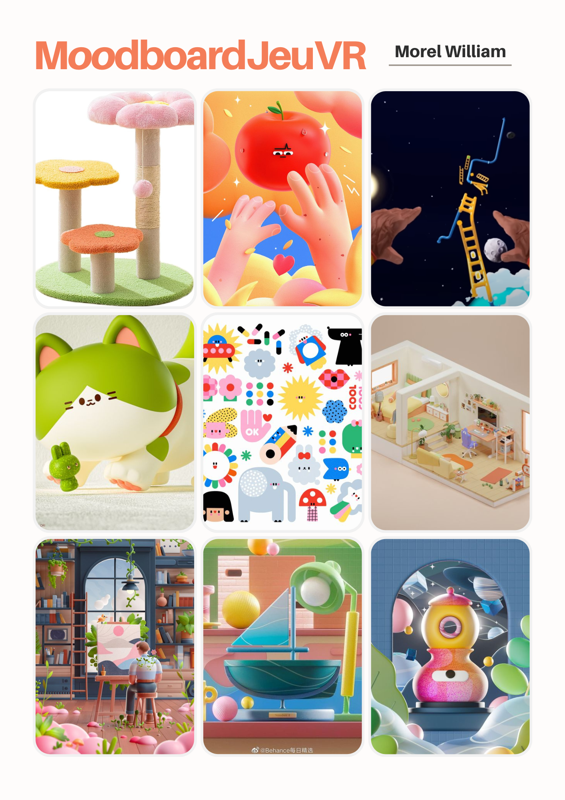

# Pierrot une grande aventure

# Moodboard

# Résumé du projet
Pierrot doit retrouver tout les autocollants que son ennemi juré Milou à caché dans différents portails.

## Description du projet
Le jeu va être un type parcours et va être un mélange entre [Gorilla Tag](https://store.steampowered.com/app/1533390/Gorilla_Tag/), [Mirror Edge](https://store.steampowered.com/app/1233570/Mirrors_Edge_Catalyst/) et [Only Up](https://store.steampowered.com/app/2562240/Only_Up/)

## Synopsis
Pierrot, un petit chat, est un fanatique d'autocollants et il adore en mettrent sur ses pattes, mais malheureusement Milou, un petit chat, à caché ces autocollants dans [nombre de portails] portails donc Pierrot doit, à l'aide de ses pattes et de son agilité, chercher ses autocollants.

## Lieu

## Aspects techniques

## Tableau avec les tâches principales du jeu
[trello](https://trello.com/invite/b/SlbCPufY/ATTId80f81a325fbaf76761d72c1def17f2d1F6E0FBA/travail-final-vr)
