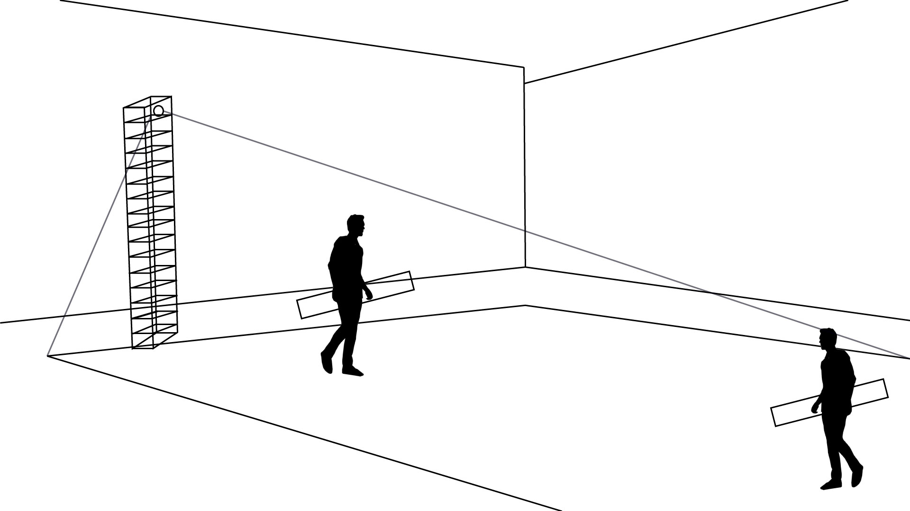
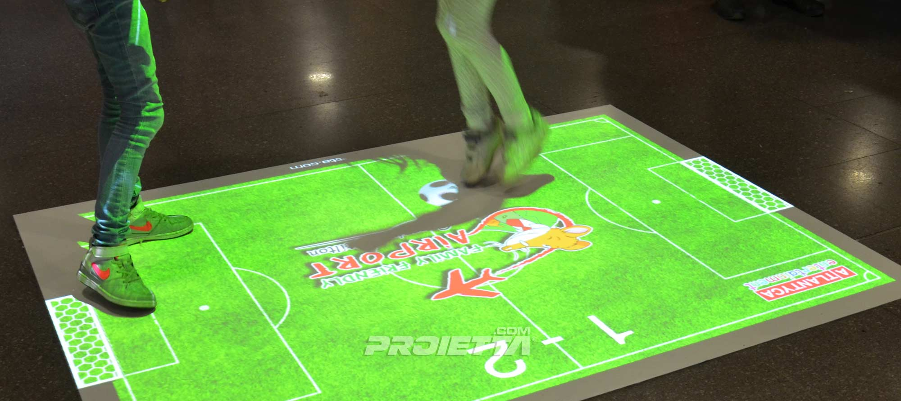
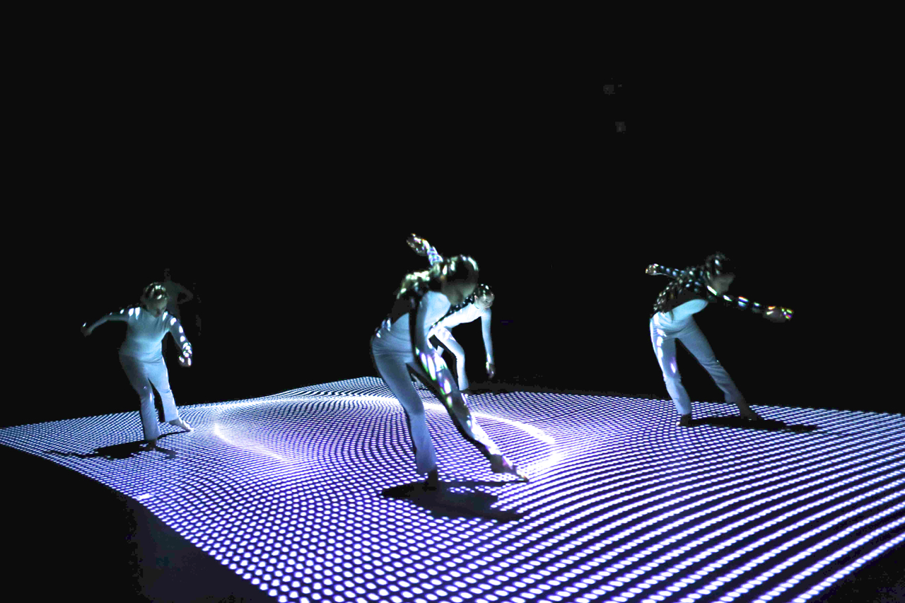

# Jeu intéractif

# Explication du projet
Ce projet est très inspiré du jeu "pong" par la société Atari. Le projet serait sectionner en 2 partie, une partie extérieure et une intérieure.
# Première partie
La première oeuvre est une projection au sol qui sera intéractive à l'aide d'un module externe. Ce module sera deux boites intéractives qui seront équipés de capteur pour détecter un module dans la projection. Donc nous pourrons jouer au Pong, mais dans la vrai vie. Les intéracteurs seront les barres de pong et la projection sera le terrain de jeu. Pour mieux comprendre voici un plan de la première partie.
## Premier Lieu

## Plan première partie

# Deuxième partie
## Deuxième Lieu

## Matériels
- Kinect
- Projecteur
- Pilier pour le projecteur et la kinect
- 

## Techniques qui pourront être utilisées

## Exemples

