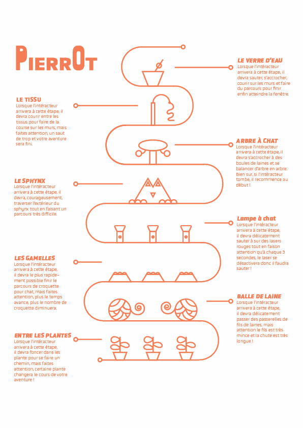

# Pierrot une grande aventure

# Moodboard

## Moodboard d'image

## Moodboard sonore
[ronronnement](https://www.youtube.com/watch?v=l0RhTYQdMGo)
[Cartoon sound](https://www.youtube.com/watch?v=UOC1vhYWZNQ)
[Horloge](https://www.youtube.com/watch?v=-A-AW1lg_1o&t=1507s)
[Objet qui tombe](https://www.youtube.com/watch?v=bRKPQaXfPAY)
# Résumé du projet
Pierrot doit retrouver atteindre la fenêtre pour sortir de son rêve.

## Description du projet
Le jeu va être un type parcours et va être un mélange entre [Gorilla Tag](https://store.steampowered.com/app/1533390/Gorilla_Tag/), [Mirror Edge](https://store.steampowered.com/app/1233570/Mirrors_Edge_Catalyst/) et [Only Up](https://store.steampowered.com/app/2562240/Only_Up/) L'intéracteur devra courir sur les murs, s'accrocher à des fils, faire du parcours et ect... Le jeu est fait pour que vous éprouvez de la frustration, à chaque fois que vous tomberez, vous serez automatique dirigé vers une étape inférieure ou dans le pire des cas, la fin. Cette emplacement sera aléatoire grâce au collider des objets, si par exemple : mon personnage tombe et je tombe sur une plante, peut-être que cette plante me poussera jusqu'au début du jeu, mais peut-être que mon personnage tombera d'un étage. À la fin du parcours, l'intéracteur aura une cinématique de fin et il atteindra la fenêtre.

## Synopsis
Pierrot, un petit chat, est un fanatique de croquette. Un jour il s'endormit dans ses croquettes, mais à son réveil il sera dans une dimension parllèle où la maison de son maitre sera transformé en une vraie épreuve. Pour sortir de son rêve, Pierrot doit sortir par la fenêtre du salon et celle-ci se situe au haut de l'épreuve. Il devra braver 8 épreuves, Entre les plantes, Balle de laine, Les gamelles, Lampe à chat, Le sphynx, L'arbre à chat, Le tissu et Le verre d'eau. 

## Carte

## Aspects techniques
La méchanique principal du jeu sera le collider. Il sera beaucoup utilisé pour faire les courses sur les murs, la collisition avec les objets, la collisition du joueur avec le décors lors d'une chute et la collisition du joueur avec le sol.
Aussi, nous aimerions utiliser l'effet d'hauteur pour créer un sentiment de vertige à l'utilisateur.
## Diagramme

## Tableau avec les tâches principales du jeu
[trello](https://trello.com/invite/b/SlbCPufY/ATTId80f81a325fbaf76761d72c1def17f2d1F6E0FBA/travail-final-vr)
